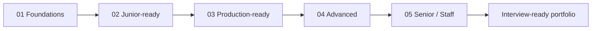

# Data Engineering Interview Roadmap

   

> **A practical path from SQL basics to production-grade data systems.**

[**Start here**](docs/level-check.md) · [**Follow the roadmap**](docs/roadmap.md) · [**Build projects**](projects/README.md) · [**Prepare for interviews**](interview/README.md)

## Visual learning path

خارطة طريق عملية ومجانية للاستعداد لمسار **Data Engineering** ومقابلاته، من الصفر حتى مستوى Senior/Staff. هذا المشروع ليس قائمة أدوات للحفظ؛ بل منهج متدرج يربط بين الأساسيات، بناء الأنظمة، تشغيلها في الإنتاج، والقدرة على شرح القرارات في المقابلة.

> **الفكرة الأساسية:** لا تنتقل إلى أداة جديدة قبل أن تستطيع بناء Pipeline صغيرة، اختبارها، مراقبتها، وإعادة تشغيلها بأمان.

## لمن هذا الريبو؟

يناسب المبتدئ الذي يريد مساراً واضحاً، ومطور البرمجيات أو محلل البيانات الذي يريد الانتقال إلى Data Engineering، وكل من يستعد لمقابلات SQL وPython وData Modeling وSystem Design. المحتوى عربي في الشرح مع إبقاء المصطلحات الإنجليزية بين قوسين حتى يكون البحث عن الوظائف والمراجع أسهل.

## كيف تستخدمه؟

ابدأ باختبار تحديد المستوى في [`docs/level-check.md`](docs/level-check.md)، ثم اختر المستوى الذي ينقصك بدلاً من إعادة دراسة كل شيء. لكل مستوى مخرجات قابلة للقياس ومشروع إثبات (Proof Project). استخدم [`docs/study-plan.md`](docs/study-plan.md) كخطة 16 أسبوعاً، أو عدّلها حسب وقتك. بعد كل مشروع اكتب صفحة README تشرح المشكلة، الـ grain، التصميم، اختياراتك، اختبارات الجودة، التكلفة التقريبية، وما الذي ستغيره في الإنتاج.

## خريطة المستويات

| ◆ | المسار | النتيجة |
|---|---|---|
| `01` | Foundations | أساس برمجة وSQL قابل للتطبيق |
| `02` | Junior-ready | أول Batch pipeline موثوقة |
| `03` | Production-ready | Warehouse مع quality وorchestration |
| `04` | Advanced | Distributed processing وstreaming |
| `05` | Senior / Staff | System design وreliability وcost |

| المستوى | الهدف | المهارات المركزية | إثبات الجاهزية |
|---|---|---|---|
| 0 — Foundations | فهم البرمجة والبيانات | Linux، Git، Python، SQL، HTTP، أساسيات قواعد البيانات | سكربت Python و20 مسألة SQL موثقة |
| 1 — Junior-ready | بناء Batch ETL موثوق | PostgreSQL، APIs، CSV/JSON، Docker، data cleaning، testing | Pipeline محلية من API إلى PostgreSQL |
| 2 — Production-ready | تصميم Warehouse وتحويلات قابلة للصيانة | dimensional modeling، dbt، orchestration، incremental loads، observability | مستودع تحليلي مع tests وDAG وbackfill |
| 3 — Advanced | معالجة موزعة وStreaming | Spark/PySpark، Kafka، partitioning، schema evolution، lakehouse | Pipeline batch + streaming مع replay وdeduplication |
| 4 — Senior/Staff | اتخاذ قرارات معمارية وتشغيل المنصة | system design، reliability، security، cost، governance، mentoring | تصميم منصة end-to-end والدفاع عن trade-offs |

## محتويات الريبو

| المسار | الملف |
|---|---|
| خارطة المهارات والمخرجات | [`docs/roadmap.md`](docs/roadmap.md) |
| خطة مذاكرة أسبوعية | [`docs/study-plan.md`](docs/study-plan.md) |
| Study Tracker قابل للنسخ | [`templates/study-tracker.md`](templates/study-tracker.md) |
| دليل استخدام الـ Tracker | [`docs/study-tracker-guide.md`](docs/study-tracker-guide.md) |
| اختبار تحديد المستوى | [`docs/level-check.md`](docs/level-check.md) |
| المشاريع المتدرجة | [`projects/README.md`](projects/README.md) |
| تحضير المقابلة | [`interview/README.md`](interview/README.md) |
| الشركات وأنماط التقديم | [`interview/companies.md`](interview/companies.md) |
| المصادر المجانية | [`resources/free-resources.md`](resources/free-resources.md) |
| طريقة المساهمة | [`CONTRIBUTING.md`](CONTRIBUTING.md) |

## Study Tracker

هل تريدين متابعة تقدمك بطريقة عملية؟ انسخي [`templates/study-tracker.md`](templates/study-tracker.md) إلى مجلدك الشخصي، ثم استخدمي [`docs/study-tracker-guide.md`](docs/study-tracker-guide.md) لتحديد الأهداف الأسبوعية، تسجيل الجلسات، ربط الإنجاز بدليل، ومراجعة الفجوات قبل الانتقال للمستوى التالي.

## اقتراحات التطوير القادمة

| الأولوية | الإضافة | القيمة |
|---:|---|---|
| 1 | بنك SQL متدرج مع حلول واختبارات | يحول الخطة إلى ممارسة يومية قابلة للقياس |
| 2 | قوالب README وADR وData Contract | يرفع جودة مشاريع الـ portfolio |
| 3 | مشروعان runnable عبر Docker Compose | يجعل التعلم reproducible لا نظرياً فقط |
| 4 | GitHub issue templates للتحديات والأسئلة | يشجع المجتمع على المساهمة المنظمة |
| 5 | قاموس عربي/إنجليزي للمصطلحات | يساعد المبتدئ العربي في البحث والمقابلات |
| 6 | مراجعة دورية للروابط والإصدارات | يمنع تقادم المصادر والأوامر |

## المنهج في جملة واحدة

**SQL وPython أولاً، ثم modeling وpipelines، ثم orchestration وwarehouse، ثم distributed/streaming، وأخيراً system design والاعتمادية والتكلفة.** تعلم الأداة داخل مشكلة حقيقية، لا كحفظ لأسماء المنتجات.

## مشروع التخرج المقترح

ابنِ منصة بيانات لمنتج رقمي: ingest لبيانات أحداث من API أو ملفات، raw layer غير معدلة، transformations عبر SQL/dbt، warehouse، orchestration عبر Airflow، dashboard أو serving layer، ثم أضف مساراً streaming اختيارياً عبر Kafka وSpark. يجب أن يتضمن المشروع data contract، اختبارات uniqueness/not-null/freshness، idempotent rerun، backfill موثقاً، وREADME يشرح لماذا اخترت batch أو streaming.

## المصادر والمنهجية

تم بناء التسلسل بالاستفادة من خارطة roadmap.sh العامة، ومنهج Data Engineering Zoomcamp المجاني، والتوثيق الرسمي لـ Python وPostgreSQL وAirflow وdbt وApache Spark، مع استخدام interview handbook مفتوح كمرجع لمحاور المقابلات—not as copied content. الروابط التفصيلية وتعريف كل مصدر موجودة في [`resources/free-resources.md`](resources/free-resources.md).

## الترخيص

المحتوى الأصلي في هذا الريبو مرخص تحت **MIT**. الروابط والمراجع الخارجية تبقى مملوكة لأصحابها، ويجب احترام تراخيصها عند إعادة استخدام أي مادة.

## References

[1]: https://roadmap.sh/data-engineer "roadmap.sh — Data Engineer Roadmap"
[2]: https://github.com/DataTalksClub/data-engineering-zoomcamp "DataTalksClub — Data Engineering Zoomcamp"
[3]: https://github.com/datadriven-io/data-engineering-interview-handbook "DataDriven — Data Engineering Interview Handbook"
[4]: https://spark.apache.org/ "Apache Spark official website"
[5]: https://docs.python.org/3/tutorial/ "Python Tutorial"
[6]: https://www.postgresql.org/docs/current/tutorial.html "PostgreSQL Tutorial"
[7]: https://airflow.apache.org/docs/apache-airflow/stable/tutorial/index.html "Apache Airflow Tutorials"
[8]: https://docs.getdbt.com/docs/get-started-dbt "dbt Quickstarts"
