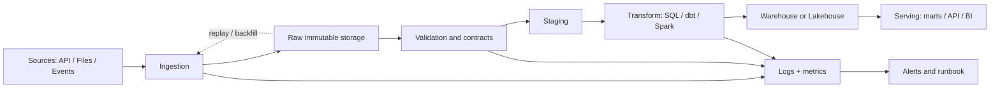

# Architecture reference

المخطط التالي ليس وصفة وحيدة؛ هو baseline يساعدك على شرح الطبقات في system design interview. غيّر المكونات عندما تتغير متطلبات freshness أو الحجم أو التكلفة.

## كيف تشرح المخطط؟

ابدأ من المصدر وحدد contract وfreshness. احتفظ بالـ raw بما يكفي لإعادة البناء، ثم افصل validation عن business transformation. وضّح أين يتم deduplication، وكيف تمنع consumer من قراءة بيانات غير مكتملة، وكيف تقيس freshness وcompleteness وpipeline lag. عند الفشل، حدّد هل تعيد retry للمهمة، أم backfill لفترة، أم replay للأحداث من offset محفوظ.

## أسئلة trade-off

| القرار | أسئلة يجب أن تجيب عنها |
|---|---|
| Raw retention | كم نحتفظ؟ ما تكلفة التخزين؟ هل نحتاج replay؟ |
| Batch vs stream | ما freshness المطلوبة؟ هل حجم الأحداث يبرر التعقيد؟ |
| Warehouse vs lakehouse | ما نمط القراءة؟ من يملك compute؟ ما متطلبات governance؟ |
| Orchestrator | هل dependencies زمنية أم event-driven؟ من on-call؟ |
| Partitioning | هل يحسن pruning أم ينتج small files أو skew؟ |
